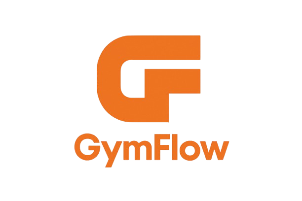

<p align="center">
  
</p>

<h1 align="center">Gymflow - Sistem Manajemen Gym</h1>

<p align="center">
Sistem manajemen gym berbasis web untuk membantu pengelolaan aktivitas dan administrasi gym secara efisien.
</p>

<p align="center">
<a href="#"></a>
<a href="#"></a>
<a href="#"></a>
</p>

## Tentang Gymflow

Gymflow adalah sistem manajemen gym berbasis web yang dirancang untuk membantu pengelola gym dalam mengatur jadwal latihan, mencatat kemajuan anggota, mengelola inventaris perlengkapan gym, dan memberikan wawasan analitik untuk meningkatkan efisiensi operasional.

## Fitur Utama

- 🏋️ **Manajemen Anggota** - Pengelolaan data anggota gym
- 📅 **Jadwal Latihan** - Sistem penjadwalan kelas dan sesi latihan
- 📊 **Pelacakan Kemajuan** - Memonitor perkembangan latihan anggota
- 📦 **Manajemen Inventaris** - Pengelolaan peralatan dan perlengkapan gym
- 👥 **Manajemen Pelatih** - Sistem pengelolaan staff dan pelatih
- 💰 **Manajemen Keuangan** - Fitur pembayaran dan tagihan

## Teknologi yang Digunakan

- **Backend**: Laravel (PHP Framework)
- **Database**: MySQL
- **Frontend**: Blade Template Engine, JavaScript
- **Asset Management**: Webpack, Mix
- **Dependency Manager**: Composer, NPM

## Instalasi

### Prasyarat

- PHP >= 8.0
- Composer
- NPM
- MySQL/MariaDB
- Web Server (Apache/Nginx)

### Langkah-langkah Instalasi

1. Clone repository:
```bash
git clone https://github.com/nama-user/Gymflow.git
cd Gymflow
```

2. Install dependency PHP:
```bash
composer install
```

3. Install dependency JavaScript:
```bash
npm install
```

4. Salin file environment dan konfigurasi:
```bash
cp .env.example .env
```

5. Generate application key:
```bash
php artisan key:generate
```

6. Konfigurasi database di file `.env`

7. Jalankan migrasi database:
```bash
php artisan migrate
```

8. Jalankan seeding (jika ada):
```bash
php artisan db:seed
```

9. Compile asset:
```bash
npm run dev
```

10. Jalankan aplikasi:
```bash
php artisan serve
```

## Struktur Project

```
Gymflow/
├── app/                    # Core application logic
├── config/                 # Configuration files
├── database/               # Migrations, seeds, factories
├── public/                 # Public assets
├── resources/              # Views, raw assets
├── routes/                 # Application routes
└── storage/                # File storage
```

## Kontribusi

Kami menyambut kontribusi dari komunitas! Silakan ikuti langkah-langkah berikut:

1. Fork project ini
2. Buat branch fitur baru (`git checkout -b fitur/NamaFitur`)
3. Commit perubahan Anda (`git commit -m 'Tambahkan fitur NamaFitur'`)
4. Push ke branch (`git push origin fitur/NamaFitur`)
5. Buat pull request

## Tim Pengembang

Project ini dikembangkan sebagai tugas akhir semester 7 - PWL (Pemrograman Web Lanjut) di jurusan Sistem Informasi.

## Lisensi

Project ini dilisensikan di bawah MIT License - lihat file [LICENSE](LICENSE) untuk detail lebih lanjut.

---

<h3 align="center">Dibangun dengan ❤️ untuk membantu dunia fitness</h3>
